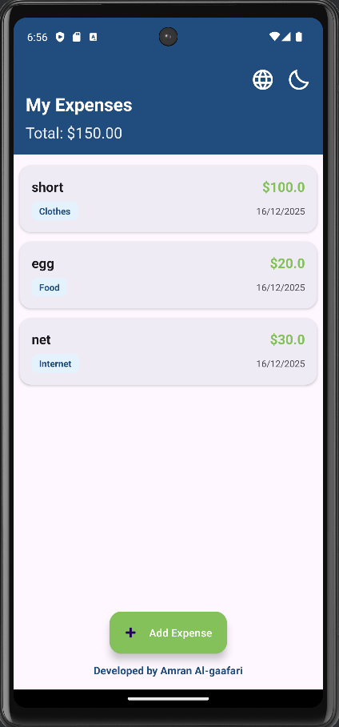
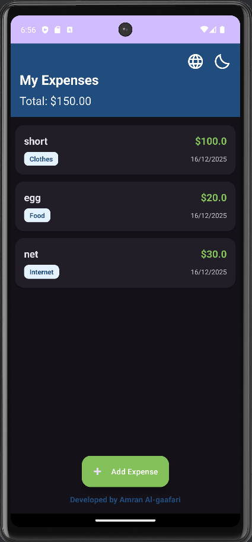
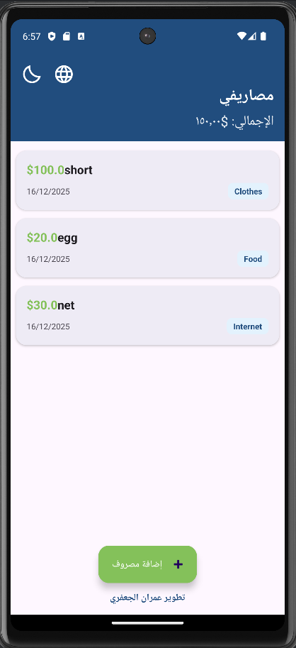
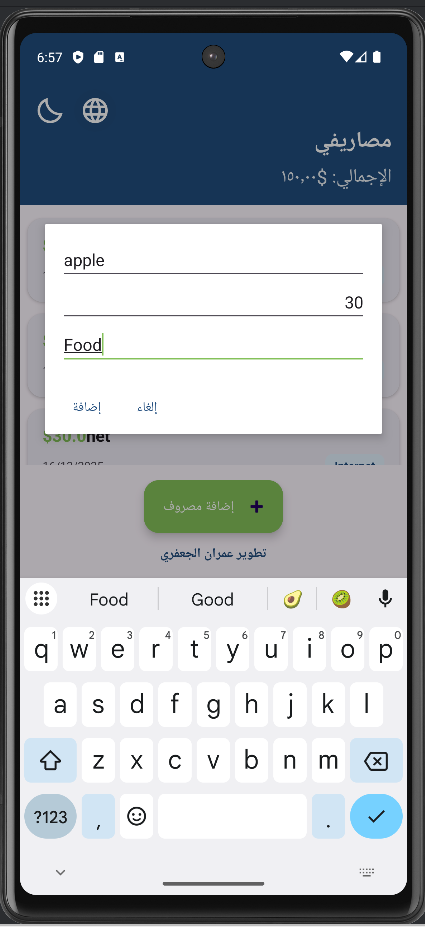

# 💰 Track Expenses App

A modern, efficient Android application designed to help users track their daily expenses with ease. Built with **Kotlin** and following the **MVVM** architecture pattern.

## ✨ Features

*   **Clean UI/UX:** User-friendly interface with Material Design components.
*   **🌙 Dark & Light Mode:** Fully supports system themes with a toggle switch.
*   **🌍 Multi-language Support:** Available in **English** and **Arabic** (RTL support).
*   **💾 Local Storage:** Uses **Room Database** to save data permanently on the device.
*   **👋 Swipe to Delete:** Intuitive gesture to remove items with an **Undo** option.
*   **📊 Smart Calculations:** Automatically calculates and displays the total expenses.

## 📱 Screenshots

| Light Mode | Dark Mode |
|:---:|:---:|
|  |  |

| Arabic Layout (RTL) | Empty State |
|:---:|:---:|
|  |  |

*(Note: Replace the image paths above with your actual uploaded image names)*

## 🛠 Tech Stack

*   **Language:** Kotlin
*   **Architecture:** MVVM (Model-View-ViewModel)
*   **Database:** Room Database (SQLite abstraction)
*   **Concurrency:** Coroutines & Flow
*   **UI Components:** RecyclerView, CardView, Material 3
*   **View Binding:** For safer interaction with views

## 👨‍💻 Developed By

**Amran Al-gaafari**

---
